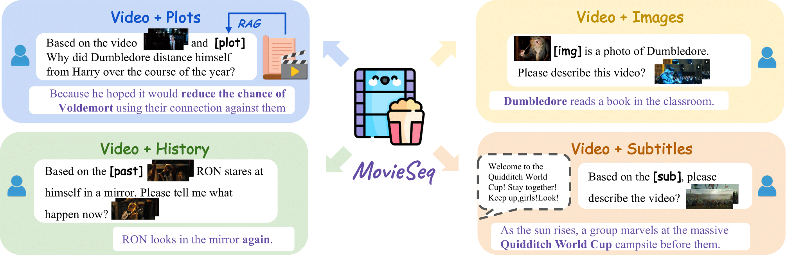

# MovieSeq (ECCV'24)



## 🎬 Movie Datasets
Our model uses CLIP vision features as inputs, so the original RGB videos are not required. You can download our provided features in this google drive.

If you need the original videos for visualization, please note that some resources may have expired over time. In such cases, please contact the author for assistance.

### [LVU](https://github.com/chaoyuaw/lvu)
1. Download the LVU metadata by `wget https://chaoyuan.org/lvu/lvu_1.0.tar.gz` then unzip `tar -xvf lvu_1.0.tar.gz`.
2. Download the LVU videos by `python3 lvu/yt-dlp.py`

### [MAD](https://github.com/Soldelli/MAD)
1. Follow this [MAD's instruction](https://github.com/Soldelli/MAD) to download the features.

### [MovieNet](https://movienet.github.io/)
1. Follow this [MovieNet's instruction](https://opendatalab.com/OpenDataLab/MovieNet/tree/main/raw) to download the keyframes.

### [CondensedMovies](https://www.robots.ox.ac.uk/~vgg/data/condensed-movies/)
1. Download the cmd videos by `python3 cmd/yt-dlp.py`

### [TVC](https://tvr.cs.unc.edu/tvc.html)
1. Download the RGB frames from [TVC website](https://tvr.cs.unc.edu/tvc.html). The website may expired, please contact the author [Jie Lei](jielei@meta.com) for help.

### [MovieQA](https://github.com/makarandtapaswi/MovieQA_benchmark)
1. Download the videos from [MovieQA repo](https://github.com/makarandtapaswi/MovieQA_benchmark?tab=readme-ov-file). The website may expired, please contact the author [Makarand Tapaswi](https://makarandtapaswi.github.io/) for help.

Organize the metadata in the following structure:
```
dataset
├── lvu
│   ├── train_relationship.tsv
│   ├── train_scene.tsv
│   ├── train_way_speaking.tsv
│   ├── val_relationship.tsv
│   ├── val_scene.tsv
│   ├── val_way_speaking.tsv
│   ├── test_relationship.tsv
│   ├── test_scene.tsv
│   └── test_way_speaking.tsv
├── mad
│   ├── mad_train.tsv
│   └── mad_val.tsv
├── movienet
│   ├── char_bank.pkl
│   ├── movienet_train.tsv
│   ├── movienet_val.tsv
│   ├── mad_val.tsv
│   └── mad_val_hp.tsv
├── cmd
│   ├── cmd_train.tsv
│   ├── cmd_val.tsv
│   └── cmd_test.tsv
├── tvc
│   ├── tvc_train.tsv
│   ├── tvc_val.tsv
│   └── tvc_test.tsv
└── movieqa
    ├── train.tsv
    ├── val.tsv
    └── test.tsv
```

Organize the features in the following structure:
```
features
├── cmd
│   └── clip_b32
│         ├── 2011
│         ├── ...
│         ├── 2020
│         └── test
├── lvu
│   └── clip_b32
│         ├── relationship
│         ├── scene
│         └── way_speaking
├── mad
│   └── clip_b32
│         ├── CLIP_B32_frames_features_5fps.h5
│         └── CLIP_L14_frames_features_5fps.h5
├── movienet
│   ├── movie_clip_l14
│   ├── clip_b32
│   └── clip_l14
├── tvc
│   └── clip_b32
└── movieqa
    └── clip_b32
          ├── tt0074285
          ├── ...
          └── tt2310332
```

