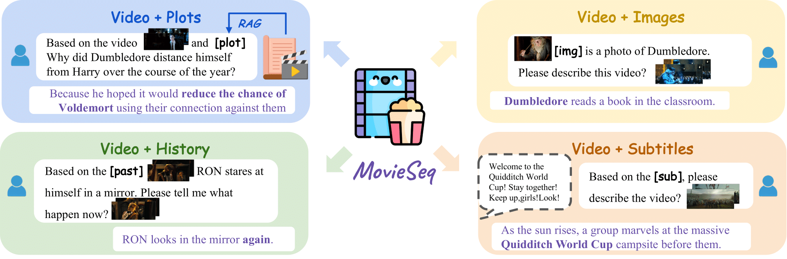

# MovieSeq (ECCV'24)

> **[Learning Video Context as Interleaved Multimodal Sequences](https://arxiv.org/abs/2407.21757)**<br>
> Kevin Qinghong Lin, Pengchuan Zhang, Difei Gao, Xide Xia, Joya Chen, Ziteng Gao, Jinheng Xie, Xuhong Xiao, Mike Zheng Shou



**TL;DR:** MovieSeq aim to enhance Large Multimodal Models for improved **Video In-Context Learning using Interleaved Multimodal Sequences** (e.g., character photo, human dialogues, etc). 

_NOTE: Recognize the baseline used in the paper LLama2 is quite old, we have developed **MovieSeq-4o** -- lightweight practical code that can be easily integrated into existing LMMs (e.g., GPT-4o) for easy usage._

**MovieSeq-4o** connects Whisper, Character images, and Video Frames to build a good video context, it can easily integrate into other VLM or APIs (such as Gemini, Claude, etc) on your own videos!

## Environments
```
conda create --name movieseq python=3.10
conda activate movieseq
conda install pytorch==2.0.0 torchaudio==2.0.0 pytorch-cuda=11.8 -c pytorch -c nvidia

pip install git+https://github.com/m-bain/whisperx.git
pip install tqdm moviepy openai opencv-python
```

## Guideline
Please refer to `example.ipynb` to learn how MovieSeq works.
Have fun!

## BibTeX
If you find our work helpful, please kindly consider citing our paper. Thank you!
```
@inproceedings{lin2024learning,
  title={Learning video context as interleaved multimodal sequences},
  author={Lin, Kevin Qinghong and Zhang, Pengchuan and Gao, Difei and Xia, Xide and Chen, Joya and Gao, Ziteng and Xie, Jinheng and Xiao, Xuhong and Shou, Mike Zheng},
  booktitle={European Conference on Computer Vision},
  pages={375--396},
  year={2024},
  organization={Springer}
}
```
